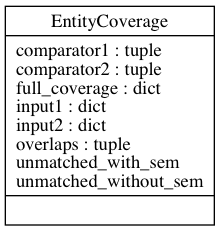
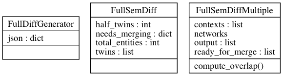
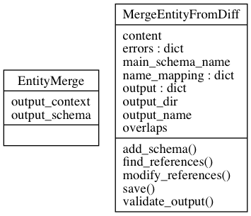

====================================================================
How to compare and merge set of JSON-LD-schemas: code documentation
====================================================================

.. automodule:: compareEntities
    :members:
    :private-members:
    :special-members:

.. image:: ../_static/classes_semDiff_compareNetwork.png

.. automodule:: compareNetwork
    :members:
    :private-members:
    :special-members:

.. automodule:: fullDiff
    :members:
    :private-members:
    :special-members:

.. automodule:: mergeEntities
    :members:
    :private-members:
    :special-members:
